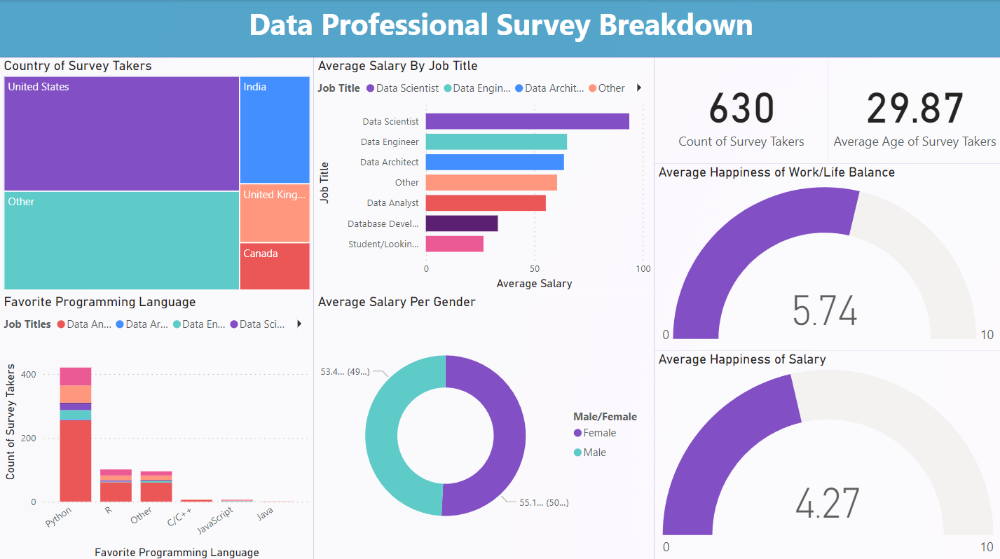

# What is DataInsight ?

DataInsight is an analysis of a dataset using Power BI, focusing on survey responses from professionals in the data industry (data scientists, analysts, engineers, etc). The dataset includes information such as job titles, yearly salaries, industry, favorite programming languages, satisfaction with various aspects of work, difficulty breaking into the field, demographics, and more.

 

# Process
- Imported survey data from Excel into Power BI.
- Utilized Power Query to clean and transform the data, creating and removing columns as needed.
- Developed a dashboard with various visualizations to present key insights from the dataset.

# Visualizations
- Stacked Bar Chart: Displays average salary by job titles.
- Stacked Column Chart: Illustrates favorite programming languages based on count.
- Gauge Graphs: Show average happiness with work/life balance and salary.
- Donut Chart: Indicates average salary by gender.
- Cards: Display count of survey takers and average age.
- Treemap: Allows users to interactively filter data by countries.

# Purpose
This project aims to provide valuable insights into the data industry, helping professionals and organizations understand trends and make informed decisions

